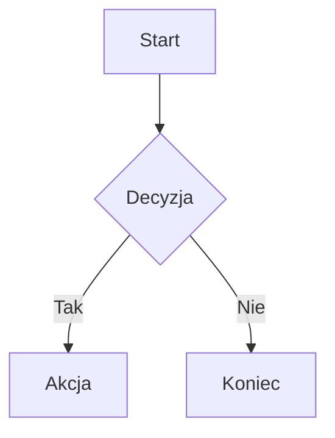

# MD2PDF

Desktopowy edytor Markdown dla Linuxa z podglądem na żywo, renderowaniem diagramów Mermaid i eksportem do PDF.

## Funkcje

- **Edytor Markdown** — CodeMirror 6 z podświetlaniem składni, numeracją linii i historią zmian
- **Podgląd na żywo** — split-view z odświeżaniem w czasie rzeczywistym
- **Diagramy Mermaid** — flowchart, sequence, class, gantt, pie i inne — renderowane do SVG
- **Eksport PDF** — generowanie PDF z osadzonymi stylami i diagramami (A4, konfigurowalne marginesy)
- **Motywy** — jasny i ciemny motyw interfejsu
- **Otwieranie i zapis plików** — praca na lokalnych plikach `.md`
- **Przeciągany splitter** — regulowana szerokość edytora i podglądu
- **AppImage** — gotowa dystrybucja dla Linuxa

## Wymagania

- Node.js >= 18
- npm >= 9
- Linux (x64)

## Instalacja

```bash
git clone <repo-url>
cd MD2PDF
npm install
```

## Uruchomienie

```bash
npm start
```

## Budowanie AppImage

```bash
npm run pack
```

Plik `.AppImage` zostanie zapisany w katalogu `release/`.

## Skróty klawiaturowe

| Skrót            | Akcja                |
|------------------|----------------------|
| `Ctrl+N`         | Nowy dokument        |
| `Ctrl+O`         | Otwórz plik          |
| `Ctrl+S`         | Zapisz               |
| `Ctrl+Shift+S`   | Zapisz jako...       |
| `Ctrl+E`         | Eksportuj do PDF     |
| `Ctrl+T`         | Przełącz motyw       |
| `Ctrl+Z`         | Cofnij               |
| `Ctrl+Shift+Z`   | Ponów                |
| `Ctrl++`         | Powiększ             |
| `Ctrl+-`         | Pomniejsz            |

## Diagramy Mermaid

Bloki kodu z językiem `mermaid` są automatycznie renderowane do SVG zarówno w podglądzie, jak i w eksporcie PDF:

````markdown

````

Obsługiwane typy diagramów: flowchart, sequence, class, state, gantt, pie, ER, journey i inne wspierane przez Mermaid.js.

## Struktura projektu

```
MD2PDF/
├── src/
│   ├── main/          # proces główny Electron (okno, menu, pliki, PDF)
│   ├── preload/       # bezpieczne API (contextBridge)
│   ├── renderer/      # UI: edytor, podgląd, stan dokumentu
│   └── shared/        # wspólne typy TypeScript
├── assets/styles/     # CSS: layout, podgląd, PDF, motywy
├── test-docs/         # przykładowe dokumenty testowe
└── electron-builder.yml
```

## Stack technologiczny

- **Electron** — powłoka desktopowa
- **TypeScript** — język główny
- **CodeMirror 6** — edytor tekstu
- **markdown-it** — parser Markdown
- **mermaid.js** — renderowanie diagramów
- **esbuild** — bundler renderera
- **electron-builder** — pakowanie AppImage

## Licencja

MIT
