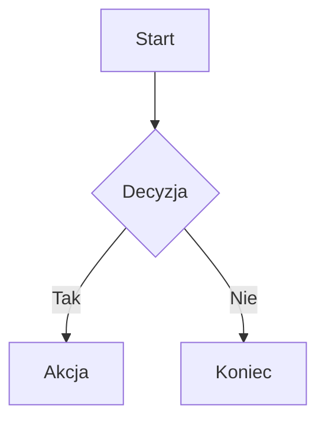

# MD2PDF

Desktopowy edytor Markdown dla Linuxa z podglądem na żywo, renderowaniem diagramów Mermaid i eksportem do PDF.
Posiada również **CLI** do konwersji wsadowej — działa bez GUI, nadaje się do cron i pipeline CI/CD.

## Funkcje

- **Edytor Markdown** — CodeMirror 6 z podświetlaniem składni, numeracją linii i historią zmian
- **Podgląd na żywo** — split-view z odświeżaniem w czasie rzeczywistym
- **Auto-reload** — automatyczne przeładowanie pliku gdy zostanie zmieniony zewnętrznie (niezapisane zmiany są chronione)
- **Diagramy Mermaid** — flowchart, sequence, class, gantt, pie i inne — renderowane do SVG
- **Diagramy LaneFlow** — swimlane diagrams z wieloma torami, bramkami i przepływem wiadomości — renderowane do inline SVG
- **Eksport PDF** — generowanie PDF z osadzonymi stylami i diagramami (A4, 1 cm marginesy)
- **Zakładki** — praca na wielu plikach jednocześnie
- **Motywy** — jasny i ciemny motyw interfejsu
- **AppImage** — gotowa dystrybucja dla Linuxa
- **CLI** — konwersja pliku lub całego katalogu do PDF bez otwierania aplikacji

## Wymagania

- Node.js >= 18
- npm >= 9
- Linux (x64)

## Instalacja

```bash
git clone <repo-url>
cd MD2PDF
git submodule update --init --recursive   # pobiera vendor/laneflow
npm install                               # postinstall buduje oba pakiety laneflow
npm run build
```

> **Uwaga:** `vendor/laneflow` to git submoduł. Przy klonowaniu z flagą `--recurse-submodules`
> lub po wykonaniu `git submodule update --init --recursive` submoduł jest pobierany automatycznie.
> `npm install` uruchamia `postinstall`, który buduje `@laneflow/parser` i `@laneflow/renderer`.
> Bez tego kroku diagramy LaneFlow nie będą renderowane.

---

## Aplikacja desktopowa

### Uruchomienie

```bash
npm start
```

### Skróty klawiaturowe

| Skrót            | Akcja                   |
|------------------|-------------------------|
| `Ctrl+N`         | Nowy dokument           |
| `Ctrl+O`         | Otwórz plik             |
| `Ctrl+S`         | Zapisz                  |
| `Ctrl+Shift+S`   | Zapisz jako...          |
| `Ctrl+E`         | Eksportuj do PDF        |
| `Ctrl+Shift+E`   | Eksportuj wszystkie PDF |
| `Ctrl+T`         | Przełącz motyw          |
| `Ctrl+Z`         | Cofnij                  |
| `Ctrl+Shift+Z`   | Ponów                   |
| `Ctrl++`         | Powiększ                |
| `Ctrl+-`         | Pomniejsz               |

### Auto-reload

Gdy plik otwarty w zakładce zostanie zmieniony przez inny edytor lub narzędzie zewnętrzne,
aplikacja automatycznie przeładuje jego zawartość. W pasku statusu pojawi się komunikat
**„Przeładowano z dysku"**.

Jeśli zakładka ma niezapisane zmiany — plik **nie zostanie** nadpisany.
Zamiast tego pojawi się ostrzeżenie **„⚠ Plik zmieniony na dysku (niezapisane zmiany)"**.

### Diagramy Mermaid

Bloki kodu z językiem `mermaid` są automatycznie renderowane do SVG w podglądzie i PDF:

````markdown

```mermaid
graph TD
    A[Start] --> B{Decyzja}
    B -->|Tak| C[Akcja]
    B -->|Nie| D[Koniec]
```
````

Obsługiwane typy: flowchart, sequence, class, state, gantt, pie, ER, journey i inne.

> **Uwaga:** Unikaj typograficznych cudzysłowów (`„"`, `""`) wewnątrz etykiet węzłów —
> parser Mermaid traktuje je jako specjalne tokeny. Używaj zwykłych cudzysłowów ASCII lub apostrofów.

### Formatowanie PDF

Każdy nagłówek `##` zaczyna nową stronę PDF, co ułatwia nawigację w długich dokumentach.

---

## CLI — konwersja bez GUI

CLI generuje PDF bezpośrednio z terminala, bez otwierania aplikacji.
Nadaje się do automatyzacji: cron, skrypty, CI/CD.

### Budowanie CLI

```bash
npm run build:cli
# lub razem z całą aplikacją:
npm run build
```

### Użycie

```bash
# Pojedynczy plik → plik.pdf obok pliku wejściowego
node dist/cli/cli.js dokument.md

# Pojedynczy plik → wskazany plik wyjściowy
node dist/cli/cli.js dokument.md --out /tmp/dokument.pdf

# Cały katalog → pliki PDF obok plików .md
node dist/cli/cli.js /moje/notatki/

# Cały katalog → pliki PDF w innym katalogu
node dist/cli/cli.js /moje/notatki/ --out /pdfs/

# Pomoc
node dist/cli/cli.js --help
```

Skrót przez npm:
```bash
npm run md2pdf -- dokument.md
```

### Opcje

| Opcja | Opis |
|-------|------|
| `--out <ścieżka>`, `-o <ścieżka>` | Plik wyjściowy lub katalog docelowy |
| `--help`, `-h` | Pokaż pomoc |

### Użycie w cron

```bash
crontab -e
```

```cron
# Co noc o 2:00 — konwertuj wszystkie notatki do /pdfs/
0 2 * * * node /home/robert/1_DEV/TOOLS/MD2PDF/dist/cli/cli.js /moje/notatki/ --out /pdfs/

# Co godzinę — aktualizuj jeden raport
0 * * * * node /home/robert/1_DEV/TOOLS/MD2PDF/dist/cli/cli.js /raporty/raport.md
```

CLI nie wymaga środowiska graficznego (Xvfb, DISPLAY itp.) — Puppeteer uruchamia Chromium w trybie headless.

---

## Budowanie AppImage

```bash
npm run pack
```

Plik `.AppImage` zostanie zapisany w katalogu `release/`.

## Uwagi dla Linux/AppImage

Aplikacja automatycznie ustawia flagi Chromium: `--no-sandbox` i `--disable-setuid-sandbox`,
ponieważ w środowiskach AppImage binarne `chrome-sandbox` wymaga `root:root 4755`, co nie zawsze jest dostępne.

---

## Struktura projektu

```
MD2PDF/
├── src/
│   ├── main/          # proces główny Electron (okno, menu, pliki, PDF, file watcher)
│   ├── preload/       # bezpieczne API (contextBridge)
│   ├── renderer/      # UI: edytor, podgląd, zakładki, auto-reload
│   ├── cli/           # CLI: konwersja Markdown → PDF bez GUI (Puppeteer)
│   └── shared/        # wspólne typy TypeScript
├── assets/styles/     # CSS: layout, podgląd, PDF, motywy
└── electron-builder.yml
```

## Stack technologiczny

| Warstwa | Technologia |
|---------|-------------|
| Powłoka desktopowa | Electron |
| Język | TypeScript |
| Edytor | CodeMirror 6 |
| Parser Markdown | markdown-it |
| Diagramy | mermaid.js |
| PDF (GUI) | Electron `printToPDF` |
| PDF (CLI) | Puppeteer (headless Chromium) |
| Bundler renderera | esbuild |
| Pakowanie | electron-builder |

## Licencja

MIT
