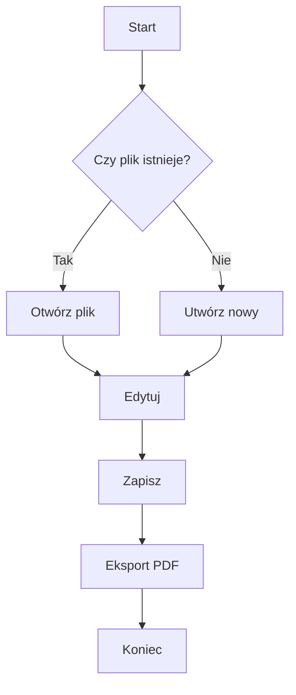
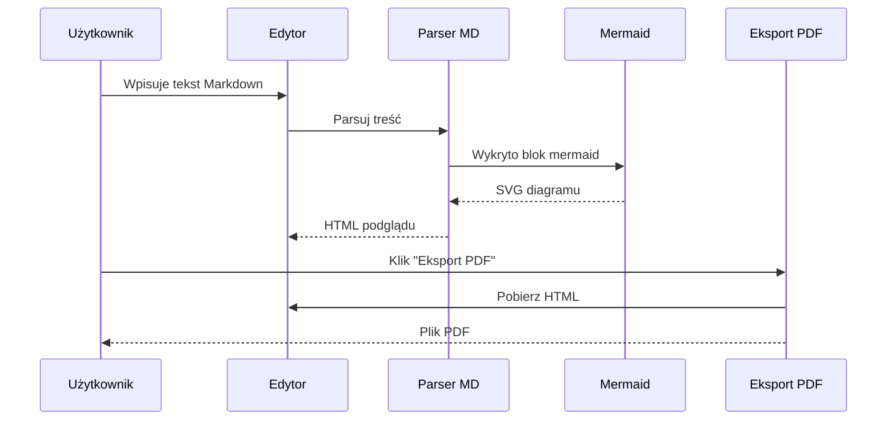
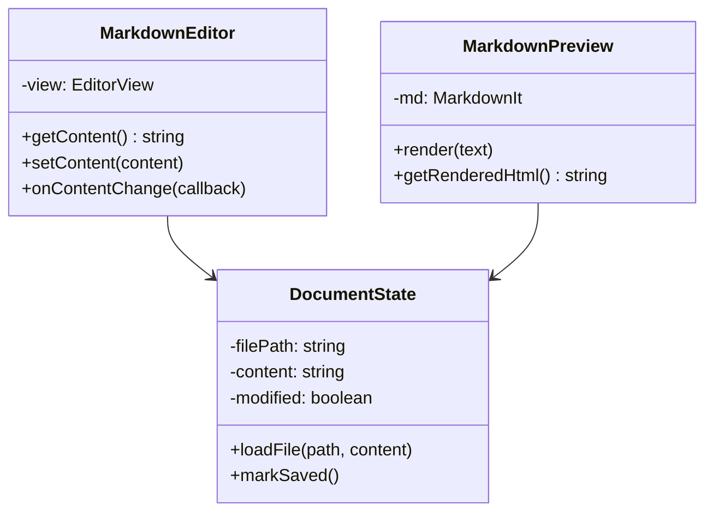
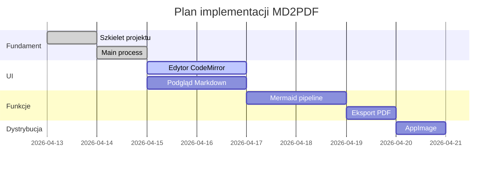
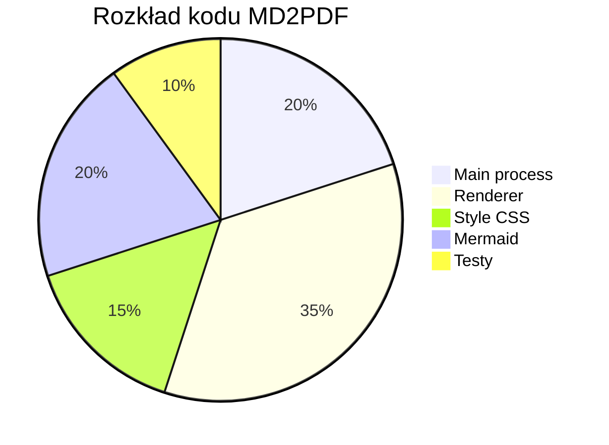

# Dokument testowy — diagramy Mermaid

## Diagram przepływu (flowchart)

```mermaid
graph TD
    A[Start] --> B{Czy plik istnieje?}
    B -->|Tak| C[Otwórz plik]
    B -->|Nie| D[Utwórz nowy]
    C --> E[Edytuj]
    D --> E
    E --> F[Zapisz]
    F --> G[Eksport PDF]
    G --> H[Koniec]
```

## Diagram sekwencji

```mermaid
sequenceDiagram
    participant U as Użytkownik
    participant E as Edytor
    participant P as Parser MD
    participant M as Mermaid
    participant PDF as Eksport PDF

    U->>E: Wpisuje tekst Markdown
    E->>P: Parsuj treść
    P->>M: Wykryto blok mermaid
    M-->>P: SVG diagramu
    P-->>E: HTML podglądu
    U->>PDF: Klik "Eksport PDF"
    PDF->>E: Pobierz HTML
    PDF-->>U: Plik PDF
```

## Diagram klas

```mermaid
classDiagram
    class MarkdownEditor {
        -view: EditorView
        +getContent() string
        +setContent(content)
        +onContentChange(callback)
    }
    class MarkdownPreview {
        -md: MarkdownIt
        +render(text)
        +getRenderedHtml() string
    }
    class DocumentState {
        -filePath: string
        -content: string
        -modified: boolean
        +loadFile(path, content)
        +markSaved()
    }
    MarkdownEditor --> DocumentState
    MarkdownPreview --> DocumentState
```

## Diagram Gantta

```mermaid
gantt
    title Plan implementacji MD2PDF
    dateFormat  YYYY-MM-DD
    section Fundament
    Szkielet projektu     :done, a1, 2026-04-13, 1d
    Main process          :done, a2, after a1, 1d
    section UI
    Edytor CodeMirror     :active, b1, after a2, 2d
    Podgląd Markdown      :b2, after a2, 2d
    section Funkcje
    Mermaid pipeline      :c1, after b1, 2d
    Eksport PDF           :c2, after c1, 1d
    section Dystrybucja
    AppImage              :d1, after c2, 1d
```

## Diagram kołowy (pie)

```mermaid
pie title Rozkład kodu MD2PDF
    "Main process" : 20
    "Renderer" : 35
    "Style CSS" : 15
    "Mermaid" : 20
    "Testy" : 10
```
